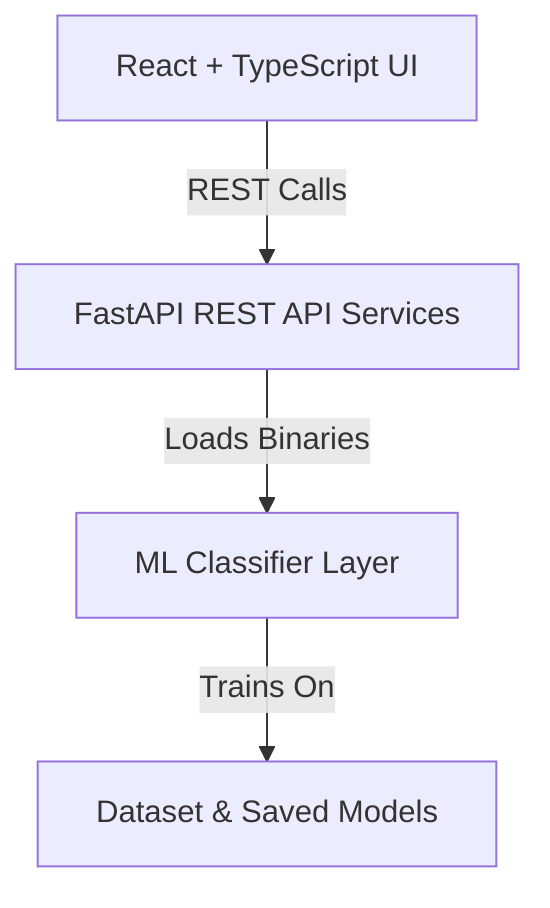

# MindSync AI – Student Digital Well-being Decision Support Platform

MindSync AI is an AI-powered student digital well-being decision-support platform designed for hackathons and academic research presentation. It processes student digital habits (such as usage hours, sleep durations, and notification metrics) to predict smartphone dependency risk, assess academic performance impact, and simulate lifestyle modifications.

---

## 🏛️ Project Architecture

MindSync AI uses a decoupled, three-tier modular layout:



---

## 📁 Folder Structure

```text
├── frontend/             # React + TypeScript + Vite + Tailwind UI
│   ├── src/
│   │   ├── components/   # Reusable Card, Button components
│   │   ├── layouts/      # MainLayout responsive sidebar wrappers
│   │   ├── pages/        # 7 UI pages (Landing, Dashboard, Assessment, Results, Simulator, etc.)
│   │   ├── services/     # api.ts fetch client
│   │   ├── App.tsx       # Routing paths configuration
│   │   ├── index.css     # Tailwind v4 theme variables
│   │   └── main.tsx      # Entry point
│   └── package.json      # Node scripts and dependencies
│
├── backend/              # FastAPI REST server
│   ├── routers/          # Endpoint routes (health, predict, simulate, analytics, report)
│   ├── schemas/          # Pydantic validation models
│   ├── config/           # Pydantic Settings loaders
│   ├── services/         # ml_service.py model loaders and XAI engines
│   ├── main.py           # Server start script
│   └── requirements.txt  # Python requirements
│
├── ml/                   # ML training pipelines
│   └── train.py          # Data cleaning, EDA plots, and model trainer
│
├── models/               # Serialized model binaries (.joblib)
│   ├── best_addiction_model.joblib
│   ├── best_academic_model.joblib
│   └── preprocessor.joblib
│
├── data/                 # Datasets & insights JSONs
│   ├── Egypt_Social_Media_Addiction_12038_train.csv
│   └── Egypt_Social_Media_Addiction_12038_test.csv
│
├── docs/                 # Platform architecture, ML, API, and test docs
│   ├── architecture.md
│   ├── ml_documentation.md
│   ├── api_documentation.md
│   ├── testing_report.md
│   └── deployment_guide.md
│
└── assets/               # Global static branding assets
```

---

## 🚀 Installation & Running Instructions

### 1. Prerequisite Installations
- Install **Node.js (v18+)** and **Python 3.10+**.

### 2. Machine Learning Training (Offline Pipeline)
Ensure the training and testing dataset CSV files are present in the `data/` directory. Run the training script:
```bash
# From the root directory
python3 ml/train.py
```
This script cleans the dataset, generates EDA charts inside the frontend public folder, and serializes the best performing models (XGBoost Regressor and Logistic Regression) to `models/`.

### 3. Backend REST Server
```bash
cd backend
pip install -r requirements.txt
python3 main.py
```
FastAPI runs on `http://localhost:8000`. You can inspect the OpenAPI interactive specifications at `http://localhost:8000/docs`.

### 4. Frontend Web App
```bash
cd frontend
npm install --legacy-peer-deps
npm run dev
```
The React hot-reload Vite server runs on `http://localhost:5173`.

---

## 🔌 API Summary Contracts

| Method | Endpoint | Description | Input Schema | Output Schema |
| :--- | :--- | :--- | :--- | :--- |
| **GET** | `/health` | Server heartbeat check | None | JSON Status |
| **GET** | `/analytics` | Dynamic dataset summary statistics | None | `AnalyticsResponse` |
| **POST** | `/predict` | Run student habits through XGBoost and get XAI weights | `PredictRequest` | `PredictResponse` |
| **POST** | `/simulate` | Sandbox habits modifications and compute delta values | `SimulateRequest` | `SimulateResponse` |
| **POST** | `/generate-report` | Generate and download a printable PDF report | `ReportRequest` | PDF file stream |

---

## 🛡️ Tech Stack & Dependencies

- **Frontend:** React 19, TypeScript, Vite, Tailwind CSS v4, Lucide React, Framer Motion, Recharts.
- **Backend:** FastAPI, Uvicorn, Pydantic, Pydantic-Settings, ReportLab (PDF rendering).
- **Data Science:** Pandas, NumPy, Scikit-Learn, XGBoost, Joblib, SHAP (Explainable AI), Matplotlib, Seaborn.

---

## 👥 Hackathon Team Credits
- **ML & Data Pipeline Engineer:** AI Software Engineer Agent
- **Backend REST Engineer:** AI Software Engineer Agent
- **Frontend UI Integrator:** AI Software Engineer Agent
# MindSync-AI-Digital-Wellness
