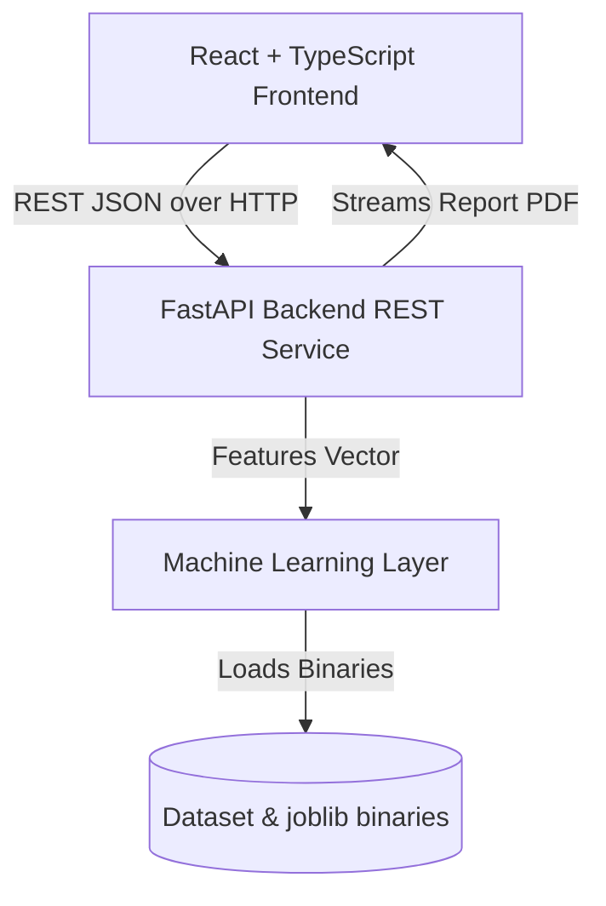
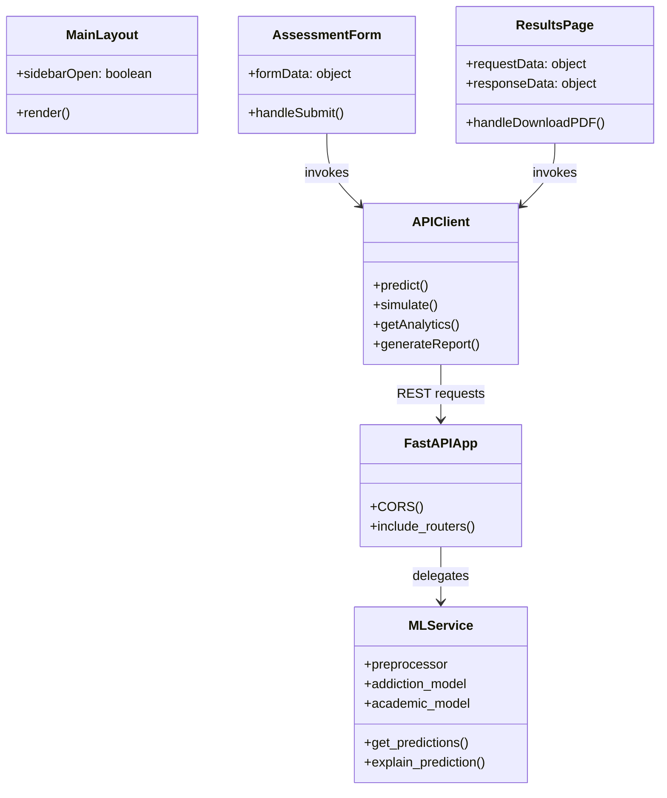
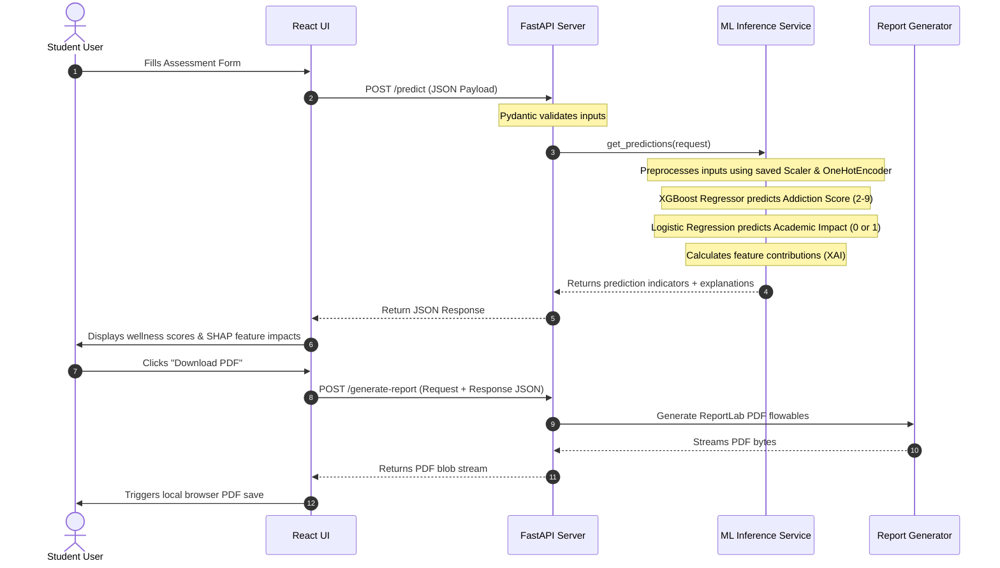

# 🏛️ System Architecture - MindSync AI

This document details the system design, data flow, component layouts, and execution workflows of **MindSync AI**.

---

## 1. High-Level Architecture Overview

MindSync AI uses a decoupled, three-tier SaaS layout designed for scalability, security, and independent testing:

1. **Client Tier (Frontend):** A Single Page Application (SPA) built with React 19, TypeScript, and Vite. Utilizes Tailwind CSS v4 for layout design, Framer Motion for transitions, and Recharts for interactive visualization.
2. **Service Tier (Backend):** A REST API built with FastAPI. Operates as an asynchronous wrapper handling request validation (Pydantic), CORS policies, route mapping, and file streams (PDF rendering via ReportLab).
3. **Intelligence Tier (ML Model):** A joblib-loaded pipeline consisting of a Scikit-Learn data preprocessor, an XGBoost Regressor (predicting Digital Addiction Score), and a Logistic Regression Classifier (predicting Academic Performance disruption probability).

---

## 2. Component Design

---

## 3. Data Flow Diagram (End-to-End Prediction Loop)

---

## 4. Deployment Flow

- **Frontend:** Compiled to static HTML/JS/CSS assets via Rolldown/Vite (`npm run build`). Can be deployed to static hosting providers (Netlify, Vercel, Firebase Hosting).
- **Backend:** Packaged with `requirements.txt` and served using a WSGI/ASGI wrapper such as Gunicorn/Uvicorn on a virtual machine or containerized cloud platform (Google Cloud Run, AWS ECS).
